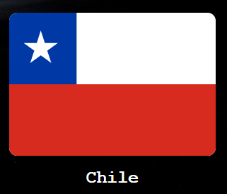
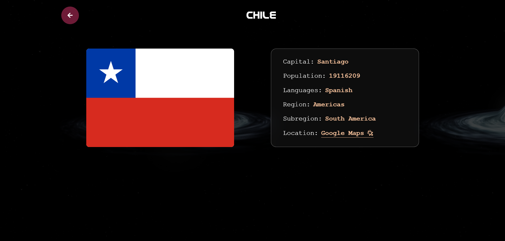
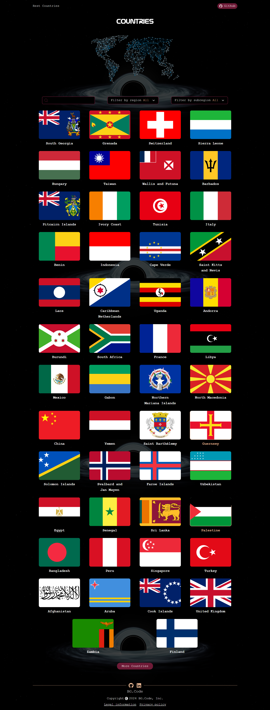

# Countries

The main idea is to create a website that allows you to search for a country or to be able to see the different flags of other countries.

## ⚙️ Function of the website

- Search: Allows you to search for the desired country.
- Filter region: Displays the countries in that selected region.
- Filter subregion: Displays the countries of the selected subregion.
- Country card: Allows to display the flag and country name

  

  When you click on the country card, another page will appear where you will be able to see more details about the country.

    

## 🚀 Technologies and tools used

- [ReactJS](https://es.react.dev/)
- [Vite](https://vitejs.dev/)

### Dependencies

- [sass](https://sass-lang.com/)
- [React-icons](https://www.npmjs.com/package/react-icons)
- [React-router](https://reactrouter.com/en/main)

### API

- [Rest Countries](https://restcountries.com/).

## 📊 Project status

| Status         | Start date | End date |
| -------------- | ---------- | -------- |
| ⌛ In progress | 2024-08-20 |          |

<!-- ## 🌐 Website -->
<!--  -->
